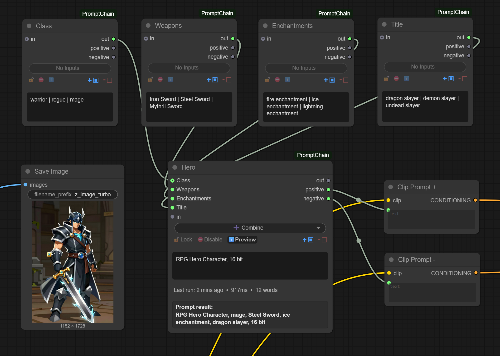
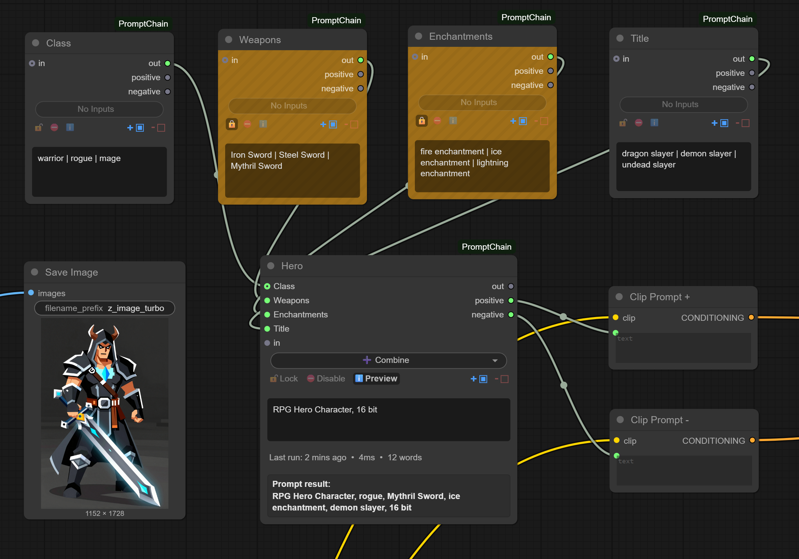
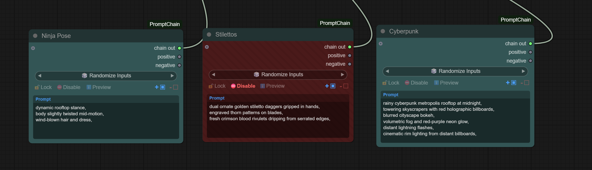
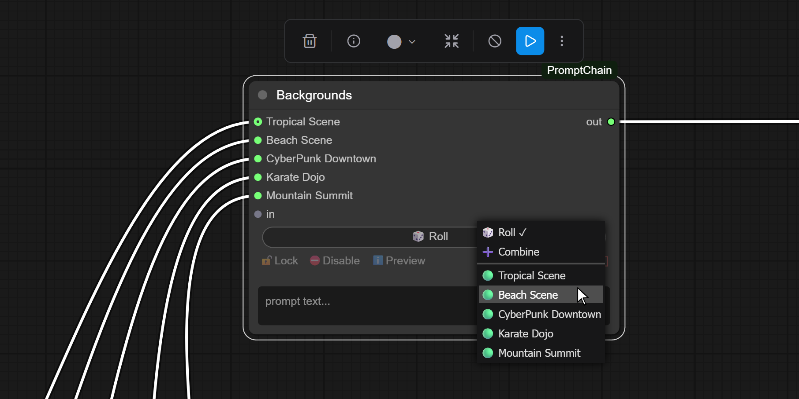

# ComfyUI-PromptChain

A visual prompt engineering toolkit for ComfyUI. Chain prompts together, see what fires, lock what works.

## The Problem

Complex prompts with randomization become unreadable fast:

```
{warrior|mage|rogue}, {iron|steel|mythril} {sword|axe|staff},
{{fire|ice|lightning} enchantment|no enchantment}, {dragon|demon|undead} slayer
```

Now nest a few levels deeper. Add 20 options per group. Good luck debugging which path fired.

## The Solution

PromptChain makes the hierarchy *spatial*. Instead of parsing nested braces in your head, you see the decision tree as connected nodes:



Each node shows exactly what it output. Chain them together, see the whole prompt path at a glance.

## Installation

```bash
cd ComfyUI/custom_nodes
git clone https://github.com/mobcat40/ComfyUI-PromptChain.git
```

Restart ComfyUI. No external dependencies required.

## Features at a Glance

- **Dual prompt support** — Handle both positive and negative prompts in a single chain
- **Inline wildcards** — Write `red | blue | green` directly in nodes. No external files required.
- **Visual chaining** — Connect nodes to build rich, meaningful structures
- **Dynamic inputs** — Inputs auto-expand as you connect more nodes
- **Live preview** — See what fired, when it fired, in real-time
- **Lock system** — Freeze outputs with upstream propagation
- **Disable system** — Mute entire branches with one click
- **Import/Export** — Convert to/from Dynamic Prompt syntax
- **Tag deduplication** — Automatic duplicate removal
- **Three modes:**
  - `🎲 Randomize Inputs` — Pick one random path from connected inputs
  - `➕ Combine Inputs` — Merge all paths with intelligent interleaving
  - `🔛 Switch Input` — Manually select which input to pass through

---

## Nodes

### PromptChain (Main Node)

The core node for all prompt processing, combining, and randomization.

#### Outputs

| Output | Description |
|--------|-------------|
| `chain` | Bundle containing both positive and negative prompts (for chaining to other PromptChain nodes) |
| `positive` | Plain positive prompt text (connect to CLIP positive) |
| `negative` | Plain negative prompt text (connect to CLIP negative) |

#### Menubar Controls

The menubar at the top of each node provides quick access to all controls:

| Control | Description |
|---------|-------------|
| 🔒/🔓 Lock | Freeze output (orange when active) |
| ⛔ Disable | Mute node (red when active) |
| ℹ️ Preview | Show live output preview (blue when active) |
| `+` checkbox | Show/hide positive prompt text field |
| `-` checkbox | Show/hide negative prompt text field |
| Mode dropdown | Select between Randomize/Combine/Switch modes |

---

### PromptChain Debug (Utility Node)

Inspector node for debugging text flowing through your prompt chain.

**Purpose:** Logs the text reaching your CLIP/KSampler nodes to help debug complex chains.

**Inputs:**
- `text` — Text to inspect
- `label` — Optional label for the debug output (default: "positive")

**Output:**
- `text` — Passes through input unchanged

**Usage:** Insert between any connection to see what's actually being passed. Check `debug.log` for output.

---

## Dual Prompt Support

PromptChain handles both **positive and negative prompts** in a single unified chain.

### How It Works

Each PromptChain node has two text fields:
- **Positive prompt** (blue-tinted header) — Your main prompt content
- **Negative prompt** (red-tinted header) — Things to avoid

Both prompts flow through the chain together via the `chain` output. At the end of your chain, use the separate `positive` and `negative` outputs to connect to your CLIP nodes.

### Visibility Toggles

Use the `+` and `-` checkboxes in the menubar to show/hide each prompt field:
- `+` — Toggle positive prompt visibility
- `-` — Toggle negative prompt visibility

This helps reduce clutter when you only need one prompt type in a particular node.

### Example Setup

```
[Style Node]                    [Subject Node]                    [Final Node]
┌──────────────────┐           ┌──────────────────┐              ┌──────────────────┐
│ + cinematic |    │           │ + warrior | mage │              │                  │──→ positive → CLIP
│   dramatic       │──chain──→ │                  │──chain──→    │                  │
│ - blurry | ugly  │           │ - deformed       │              │                  │──→ negative → CLIP
└──────────────────┘           └──────────────────┘              └──────────────────┘
```

---

## Modes

### 🎲 Randomize Inputs

Picks **ONE random input** from all connected inputs.

- The node's text field is prepended to the selected input
- Use for branching logic where you want one path chosen randomly
- Each execution may select a different input

### ➕ Combine Inputs

Merges **ALL inputs** using breadth-first interleaving.

Tags round-robin across branches so no single branch dominates the token budget:

```
Input branches: ["a, b, c, d", "X, Y"]
Output:         "a, X, b, Y, c, d"
```

Not `"a, b, c, d, X, Y"` — the interleaving ensures balanced representation.

### 🔛 Switch Input

**Manually select** which connected input to pass through.

- A dropdown appears showing all connected inputs by their source node names
- Click the dropdown or use arrow keys to cycle through inputs
- The node's text field is prepended to the selected input
- Perfect for A/B testing or debugging specific paths

---

## Wildcard Syntax

Write wildcards directly in text fields — no external files needed.

| Symbol | Meaning | Example | Result |
|--------|---------|---------|--------|
| `\|` | OR (pick one) | `red \| blue \| green` | `blue` |
| `,` | AND (include both groups) | `red \| blue, dress \| skirt` | `blue, dress` |

### Multiline Wildcards

Lines ending with `|` continue the OR group:

```
warrior |
mage |
rogue
```

Equivalent to `warrior | mage | rogue` — picks one randomly.

### Multiple Groups

Comma separates independent wildcard groups:

```
red | blue | green, large | small, fluffy | smooth
```

This picks one from each group and combines them: `"blue, small, fluffy"`

---

## Lock System

Click the **lock icon** (🔒/🔓) to freeze the current output. (For when you need to lock that sweet Mythril Ice Enchanted Sword!)



### When Locked

- Node returns cached output instead of re-processing
- Randomization results preserved across executions
- Perfect for keeping a roll you like

### Visual Indicators

| State | Appearance |
|-------|------------|
| Locked | 🔒 Orange icon + **bold yellow "Lock" text** + gold background with diagonal stripes |
| Unlocked | 🔓 Dim gray icon and text |

### Upstream Propagation

**Locking a node also locks all its input nodes** (the entire upstream chain). This ensures your complete prompt path stays frozen — from source nodes all the way to the locked node.

### Persistence

Lock state and cached output save with your workflow.

---

## Disable System

Click **⛔ Disable** in the menubar to temporarily exclude a node from the prompt chain.



### When Disabled

- Node outputs an empty string
- Downstream nodes ignore this input entirely
- The node and its upstream chain are visually marked

### Visual Indicators

| State | Appearance |
|-------|------------|
| Disabled | ⛔ Red icon + **bold red "Disable" text** + dark red background with diagonal stripes |
| Enabled | ⛔ Dim gray icon and text |

### Upstream Propagation

**Disabling a node also disables all its input nodes** (the entire upstream chain). This lets you mute an entire branch with one click.

### Use Cases

- A/B testing different branches without rewiring
- Temporarily muting parts of complex prompt trees
- Quick toggling of optional modifiers

### Persistence

Disabled state saves with your workflow.

---

## Live Preview

Toggle the **Preview** button (ℹ️) in the menubar to see real-time output.

### Preview Shows

- **Last run timestamp** — Shows elapsed time since execution (e.g., "20 mins ago"), updates in real-time
- **Selected wildcards** — See exactly which options fired
- **Full output** — The complete processed result for both positive and negative prompts
- **"Awaiting first run..."** — Shown until node executes for the first time

---

## Import & Export

Right-click any PromptChain node → **Import** or **Export**

### Import

Paste existing prompts and auto-generate clean node structures:

| Format | Example | Result |
|--------|---------|--------|
| Plain tags | `red, blue, green` | Converts to `red \| blue \| green` |
| Dynamic Prompts | `{warrior\|mage}, {sword\|staff}` | Creates connected node tree |
| Nested braces | `{a\|{b\|c}}` | Recursively expanded into node hierarchy |
| Top-level OR | `option A \| option B` | Creates separate input nodes |

### Export

Convert your node tree back to Dynamic Prompt format:

- Traverses all connected upstream nodes
- Converts wildcards to brace syntax
- Respects modes: Randomize → `{a|b}`, Combine → comma-joined
- Opens dialog with exportable string ready to copy

---

## Tag Deduplication

Duplicates are automatically removed. **First occurrence wins:**

```
Input:  "red, blue, RED, green, Blue"
Output: "red, blue, green"
```

- Case-insensitive matching
- Special tags like `[BREAK]` are always preserved
- Early nodes = intentional placement; later duplicates from merges get removed

---

## Dynamic Inputs

Input slots automatically expand as you connect more nodes:

- Connect a node → new empty slot appears
- Disconnect → empty slots are cleaned up (keeps at least one)
- Input labels show connected node titles for easy identification
- No manual slot management needed

---

## Example Workflows

### RPG Character Generator

```
Node 1 (Randomize):            Node 2 (Randomize):           Node 3 (Combine):
┌─────────────────┐           ┌─────────────────┐           ┌─────────────────┐
│ warrior |       │           │ steel | mythril │           │ fire enchant,   │
│ mage | rogue    │──────────→│ sword | staff   │──────────→│ dragon slayer   │
└─────────────────┘           └─────────────────┘           └─────────────────┘

Possible output: "warrior, mythril staff, fire enchant, dragon slayer"
```

### Style + Subject with Negative Prompts

```
[Style]                        [Subject]                      [Output]
┌────────────────┐            ┌────────────────┐            ┌────────────────┐
│ + cinematic |  │            │ + portrait of  │            │                │→ positive
│   moody | soft │──chain────→│   a warrior    │──chain────→│                │
│ - cartoon      │            │ - bad anatomy  │            │                │→ negative
└────────────────┘            └────────────────┘            └────────────────┘

positive: "cinematic, portrait of a warrior"
negative: "cartoon, bad anatomy"
```

### A/B Testing with Switch Mode

```
[Option A]─────┐
               │
[Option B]─────┼──→ [Switch Node] ──→ Output
               │    (manually select)
[Option C]─────┘
```

Use the dropdown to instantly swap between options without rewiring.

---

## Trait Mixing Networks

Wire Randomize nodes in a **mesh** instead of a tree for combinatorial trait mixing:

```
[Fur Type]──┐     ┌──[Randomize]──┐
            ├────→┤               ├────→[Combine]──→ Final
[Fur Color]─┤     └──[Randomize]──┤
            │                     │
[Creature]──┴─────[Randomize]─────┘
```

Each Randomize node acts as selection pressure. Cross-wire your trait pools and every run produces a unique combination — like breeding.

Example pools:
- `Shiny Fur | Matted Fur`
- `Silver | Black | Red`
- `Werewolf | Bear`

Natural output: "Red, Shiny Fur, Werewolf" — emergent behavior from simple primitives.

---

## Prompt Palette

Use Switch mode to build a reusable prompt control panel:



**How it works:**

1. Create a Switch node for each category (Style, Pose, Character, Outfit, etc.)
2. Connect pre-built prompt options to each Switch
3. Use the dropdown or arrow keys to flip between presets
4. All Switches feed into a final Combine node

**Why this pattern is powerful:**

- **Instant iteration** — Change any category without rewiring
- **Saved presets** — Your options persist with the workflow
- **Mix and match** — Combine any style with any pose with any character
- **Quick comparison** — Flip through options to find what works

Build your prompt palette once, reuse it forever. Each workflow becomes a custom prompt mixer tailored to your subject.

---

## Prompt Library Mode

Disconnected PromptChain nodes act as prompt storage:

- Drop a node, paste your prompt, leave it unwired
- Sits on your canvas as a visual "sticky note"
- Saves with your workflow
- Connect when you want to use it, disconnect to deactivate

Build a library of prompt fragments right in your workflow. Zero config, just nodes.

---

## Why PromptChain?

| Pain Point | Dynamic Prompts | PromptChain |
|------------|-----------------|-------------|
| Nested syntax | `{a\|{b\|{c\|d}}}` | Visual node tree |
| Debugging | Read the string | See what lit up |
| Positive + negative | Separate handling | Unified chain |
| External files | Required | None |
| Migration | — | One-click import |

---

## Tips & Tricks

1. **Use Lock for iteration** — Find a random combination you like? Lock it before further experiments.

2. **Disable for comparison** — Instead of deleting nodes, disable them to quickly compare with/without.

3. **Hide unused prompts** — Use `+`/`-` toggles to hide prompt fields you're not using in a node.

4. **Preview everything** — Enable preview on your final node to see the complete output.

5. **Chain outputs** — Use `chain` output when connecting to other PromptChain nodes; use `positive`/`negative` only at the end for CLIP.

6. **Debug complex chains** — Insert a PromptChain Debug node to log what's actually flowing through a connection.

---

## License

MIT License — free to use forever!
